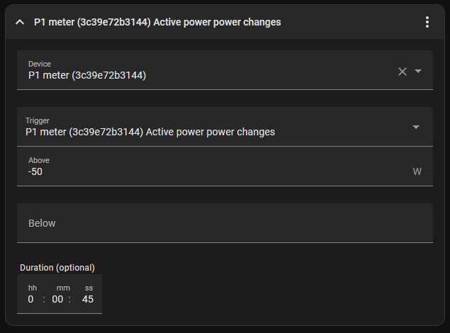

# 12kWh solar battery for 100 euro

*tl;dr we're automatically charging our boiler with excess solar power. See how, go to [the setup](xref:diy-battery#the-setup)*

## Why

Over the last couple of years, here in Belgium, we've been roll something called digital power meters. These meters are able to measure both the power you consume, as well as the power you give back to the grid.

Previously we had an analog meter that actually rolled backwards if you gave back power to the grid. This meant that you could essentially use the grid as a storage device for energy. This could be considered the perfect battery as every kWh you put in, you could get back out.

This usually resulted in people giving back excess power during the summer to the grid, when prices on the energy market are low, and then taking back that power during the winter when prices are high. This was a great way to save some money on your energy bill and very good for the people with solar panels. But as you can probably see, not that great for the energy companies and community.

To circumvent this we're being moved over step by step to these digital power meters. By knowing the difference you consume, and return to the grid, the energy companies can now charge you for the difference. With the intended goal to incentivize people to consume the power that they produce as much as possible.

In addition to this, the distribution company also imposed a [peak tax](https://www.fluvius.be/nl/blog/capaciteitstarief/capaciteitstarief-nieuwe-berekening-nettarieven-piekvermogen) on top op the current bill, the biggest peak for every month (measured over a span of 15 minutes) is averaged out over the year and for this you'll be charged a premium. This is to incentivize people to spread out their consumption over the day, instead of having a big peak in the morning and evening, and to reduce the overall load on your grid.

This is has resulted in a market growing for people to install electric batteries in their homes to store excess power during the day, and use it during the evening. This is a great solution, but it's also quite expensive. The batteries degrade over time, the loose charge over time, and there is a loss of around [10-20%](https://carbontrack.com.au/guides/energy-efficiency-guide/battery-storage/) when charging and discharging the battery. And this all to cover the difference between your production and consumption price. Needless to say, there are justifiable reasons that batteries will never give you a return on investment. Unless of course, we can have a battery that is already installed in our home, and that we don't have to pay for.

## The battery

A battery is basically a device that stores energy. The first thing that comes to mind are these [electric battery storage](https://en.wikipedia.org/wiki/Home_energy_storage), but this can also be [pumped storage hydro electric](https://en.wikipedia.org/wiki/Pumped-storage_hydroelectricity), or heat storage. 

The latter has actually been done for years. Homes used to have electric heaters with bricks in them. The bricks would be heated during the night when the energy prices were low, and then the heat would be released during the day. This is essentially a battery, but for heat.

In my example we're going to be using an electric boiler as a battery. But as you can see, basically anything that can keep heat trapped could be considered a battery. Yes even [your entire home](https://www.youtube.com/watch?v=0f9GpMWdvWI) using your heat pump. My suggestion would be to have a look around your home, try and keep an open mind, and see what you can come up with.

## The setup

For this, we basically need 3 things:
- A real time power meter
- A way to switch the boiler on and off
- A controller

### Real time power meter

For a real time power meter there are a lot of options. Fortunately for us, the digital power meter comes with a [P1 port](https://nl.wikipedia.org/wiki/P1-poort) which is basically a communication standard to turn your digital meter into a smart meter. For this I'm using the [Home Wizard P1 wifi meter](https://www.homewizard.com/shop/wi-fi-p1-meter/) for €30. It's one of the cheaper options, doesn't require a subscription, you can access the data locally, and it's easy to integrate with other systems. There's also an app that allows you to see your consumption in real time any where in the world, and see your historical data.

### Switching the boiler

For this I'm using a [Shelly 1PM](https://www.shelly.com/en-be/products/shop/shelly-plus-1-pm-2-pack/shelly-plus-1-pm) which costs around €20. Special note here, thought you could use again close to any shelly that you may have lying around. Not all of them have the switching capacity for the power that a boiler utilizes. Be sure to check how large the power draw of your 'battery' is, and how many phases that you need to be able to switch.
Boilers are usually controlled by a programmable clock. If you want to add the shelly, just wire the switch of the Shelly to be in parallel with switch of the clock. This way you're night time charging will always remain working as a fall back.
If this all means nothing to you, maybe best to contact an electrician to help you out.
If you want to completely manage the night time charging by the shelly, this can also be integrated into the system. Go to the section [night time charging](xref:diy-battery#night-time-charging) for more information.

### Controller

Finally, where everything comes together, the brains of the operation. For this I'm using [Home Assistant](https://www.home-assistant.io/) which is basically a free open source smart home system. It's fairly easy to setup, and can run on an large number of different devices. In my case I'm using a raspberry Pi 3 that I had laying around. Thought it's at the time of writing quite pricy, they used to cost around €35 back when I purchased mine. The prices have gone down already a bit, and I'm sure they'll continue to do so. You can also run it on a virtual machine, or even in a docker container. There are a lot of options here. A good starting point for finding a Raspberry Pi is on [their website](https://www.raspberrypi.com/).

> [!NOTE]
> The most important part is that the switch and power meter can be [integrated with home assistant](https://www.home-assistant.io/integrations).

## The Configuration

### Home Assistant and integrations

First of all, you'll have to go through the setup procedure for all 3 devices. For this, this best to follow the instructions on the respective websites. I'll be using the [Home Assistant OS](https://www.home-assistant.io/installation/) on my raspberry pi, but you can use any of the other options as well.
Next, we'll need to add the devices to our home assistant to be able to communicate with it. To add the P1 meter and shelly to home assistant, you'll need to go to the 'settings' page and open 'devices & services'. It might be that these show up ready for you to add, if not you can them manually with the 'Add integration' option in the bottom right corner.

### The automation

Now that we have all the devices added to home assistant, we can start with the automation. For this we'll need to create a new automation. This can be done by going to the 'Settings' page and opening the 'automations & scenes' page. Here you can create a new automation by clicking the 'Create automation' in the bottom right corner.

Here we basically have 3 parts:
- The triggers, or what starts the automation
- The conditions, or what needs to be true for the action to run
- The actions, or what we want to happen

#### Auto on

As a trigger, we want to know the amount of power that we're exporting to be greater than the power that our boiler draws.
For this you read the specifications of your boiler, or briefly enable the boiler and keep an look at the power consumption spike. It's best to add a little buffer to this.
In my case, the boiler draws around 3kW, so I'm going to set the trigger to 3.2kW. This means that if I'm exporting more than 3.2kW, the boiler will be turned on.
We also don't want to put unnecessary strain on the boiler with cycling it on and off every time we export a little bit over the set threshold. So I'm going to add a little duration of 3 minutes. This means that the power export needs to be at least 3.2kW for 3 minutes before the boiler will be turned on.
Feel free to tweak these values to your liking.
The P1 meter has 2 power meters for peak and off peak hours, so we'll need to add 2 triggers, one for each power meter.
Your trigger should look something like this:

Finally, add the action to enable the boiler, select the device and set the state to 'on'.
Add an action for a Device, select your boiler and pick the 'Turn on' action.
Your action should look something like this:

#### Auto off

Next, we do the same thing again for the off trigger.
Here we can set the power draw to 0, or a bit below if you want some margin for spikes, or even a bit over zero in case you're OK with some power in peak hours for the benefit of using more, cheaper, solar power. In my configuration, I've opted for 50 watts below zero. In addition to a 45 second duration to once again prevent the boiler from toggling on and off too much.
And again, we'll need to add 2 triggers, one for each power meter.

And that's it! You should be good to go, now only to wait for some sun and you're charging your boiler.

## Expansion

### Night time charging

Usually these boilers are set to charge at night when the energy prices are low. If you followed the guid along you should have wired the shelly in parallel with the clock. This means that the clock will still be able to charge the boiler at night. But if you want to manage this yourself, you can also add a trigger for this. For this you'll need to add a trigger for the time, and set it to the time that you want to start charging. In my case I've set it to 2:00am. And then add an action to turn on the boiler. This should look something like this:

As an action, add a device, select your boiler and set the state to 'on'. After this, delay for the time your boiler to charge at night, and a final action to turn off the boiler. This should look something like this:

Personally, I let this setup up until now run for a couple of days to be sure that everything was working as expected. I didn't want to risk burning expensive electricity because I made a mistake, or not having any hot water in the morning because my automation didn't work.

But your call to figure out what you're comfortable with. 

### No more overcharging

Next, I've found that, when my boiler was charged completely, halfway throughout the day, or during the night time charging, the temperature would have dipped already sufficiently to start re-heating the water.
Especially at night, this could quickly be 20-30 minutes of heating the water without me ever using any.
So I've added a check to see if the boiler was charged completely during the day, and add that as a condition to the automation that would reset at 6am after the night time charging would have triggered.

For the solar charging completed check, I first added a helper. This is basically a variable that you can set in home assistant. For this I've added a helper of the type 'input boolean'. This is basically a true/false variable that you can set in home assistant. I've called mine 'Solar Charging boiler Bathroom Completed Today'. You can add a helper by going to the 'settings' page, 'Devices & Services' and opening the 'helpers' page. Here you can create a new helper by clicking the 'Create helper' in the bottom right corner.
And create a new 'Toggle'

Next we'll need to create an automation to enable the toggle to indicate that solar charging was done for that day. We can do this with the power changes for the the shelly, this indicates the power flowing through your switch, or not. If the switch is closed, but no power is flowing, indicates to use that the heat of the boiler has reached it's target.

So create a new automation. Set the device to monitor to be the Shelly and trigger to be power changes
Require that the power consumption needs to be below 10, or at least a lot lower than the amount the boiler consumes. I picked something a little over 0 just to be sure in case some idle power draw or something.

I also added a duration to ensure that the boiler was definitely fully charged. I wanted to prevent the switch from closing, it taking a couple of seconds for the power monitoring to kick in, and immediately trigger the action toggle the helper.

The resulting trigger looks like this:

As an action, I turn off the boiler, and enable the toggle to track Charge competed.

Before adding this as a condition, we want to make sure that the toggle is being reset daily. As we don't want to charge our boiler at night if the day before it was completely charged by the solar power, we can add this as a final step to our night time automation.

In the automation created in the [night time charging](xref:diy-battery#night-time-charging), add an addition action at the end to disable the helper toggle again.

If you're not using it, or if you want to ensure that you're boiler heats up again at night, add a new timed automation at the time of your liking.

Finally, we have a true/false property that toggles if the solar panels completely charged the boiler. We can start adding this into our 'On' triggered automations.
First, let's add it to the nigh time charging now that we already have this opened.

In the Conditions section, add a new check to require the Completed toggle to be 'Off'. Again, this will only be enable if you've already got a completely charge boiler from the solar charging the day before.

And add the same check to the 'On' trigger automation for your solar panel boiler charging.

> [!IMPORTANT]
> Make sure the target temperature is sufficiently high for your boiler. The configuration can result in your boiler being completely charged at 9am, and remain at this temperature for the second night until the night time charger kicks in again.

> [!IMPORTANT]
> If you're using your water after the solar charging was completed, new cold water will be in your boiler. It's then possible that you wont have sufficient hot water the following morning. To circumvent this, see the [humidity reset](xref:diy-battery#humidity-reset).

> [!NOTE]
> This requires your night time charger to also be managed by home assistant to fully work, otherwise you'll still get some power draw at night.

### Humidity reset

> [!NOTE]
> Only a potential problem incase you implemented the [over charge prevention](xref:diy-battery#no-more-overcharging).

As mention in the disclaimers of the previous section. Incase the solar charging was completed, and you use water afterwards, this will result in cold water being put into your boiler, and this not being charged anymore by your solar powers, or night time charging until the start of the next day.

There are many different ways to test this. The best is without a doubt using a flow meter on your water line going to, or coming from your boiler. This is almost the only sure fire way to know if water was consumed from the boiler.

But as you probably assumed from my lengthy opinion about Home Batteries, and wiring up your shelly, I'm an electrician, not a plumber. In addition to this, I already had a temperature sensor laying in my bathroom that I use as a thermostat inside my home assistant, which also has a built in humidity sensor.

To prevent the above issue from happening I basically used the humidity sensor to turn off the solar charge completed toggle, allowing the boiler to be charged again.
This because the shower/bath is being fed by that boiler and the only real spike in humidity that can be occur is because water was used for the shower or bath.

So for this, we again create a new automation, set the humidity sensor as a trigger. For this I need my bathroom to have a humidity of above 75% for 30 seconds. This than turns off the Solar charge Completed check, resetting the entire system and allowing the night time charger, or solar charging to work again.

The action to turn off the toggle:

