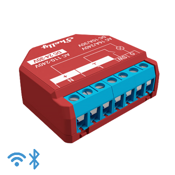
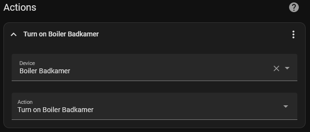

# 100 euro solar battery

*tl;dr we're automatically charging our boiler with excess solar power. See how, go to [the setup](#setup)*

## Why

Over the last couple of years, here in Belgium, we've been roll something called digital power meters. These meters are able to measure both the power you consume, as well as the power you give back to the grid.

Previously we had an analog meter that actually rolled backwards if you gave back power to the grid. This meant that you could essentially use the grid as a storage device for energy. This could be considered the perfect battery as every kWh you put in, you could get back out.

This usually resulted in people giving back excess power during the summer to the grid, when prices on the energy market are low, and then taking back that power during the winter when prices are high. This was a great way to save some money on your energy bill and very good for the people with solar panels. But as you can probably see, not that great for the energy companies and community.

To circumvent this we're being moved over step by step to these digital power meters. By knowing the difference you consume, and return to the grid, the energy companies can now charge you for the difference. With the intended goal to incentivize people to consume the power that they produce as much as possible.

In addition to this, the distribution company also imposed a [peak tax](https://www.fluvius.be/nl/blog/capaciteitstarief/capaciteitstarief-nieuwe-berekening-nettarieven-piekvermogen) on top op the current bill, the biggest peak for every month (measured over a span of 15 minutes) is averaged out over the year and for this you'll be charged a premium. This is to incentivize people to spread out their consumption over the day, instead of having a big peak in the morning and evening, and to reduce the overall load on your grid.

This is has resulted in a market growing for people to install electric batteries in their homes to store excess power during the day, and use it during the evening. This is a great solution, but it's also quite expensive. The batteries degrade over time, the loose charge over time, and there is a loss of around [10-20%](https://carbontrack.com.au/guides/energy-efficiency-guide/battery-storage/) when charging and discharging the battery. And this all to cover the difference between your production and consumption price. Needless to say, there are justifiable reasons that batteries will never give you a return on investment. Unless of course, we can have a battery that is already installed in our home, and that we don't have to pay for.

## The battery

A battery is basically a device that stores energy. The first thing that comes to mind are these [electric battery storage](https://en.wikipedia.org/wiki/Home_energy_storage), but this can also be [pumped storage hydro electric](https://en.wikipedia.org/wiki/Pumped-storage_hydroelectricity), or heat storage. 

The latter has actually been done for years. Homes used to have electric heaters with bricks in them. The bricks would be heated during the night when the energy prices were low, and then the heat would be released during the day. This is essentially a battery, but for heat.

In my example we're going to be using an electric boiler as a battery. But as you can see, basically anything that can keep heat trapped could be considered a battery. Yes even [your entire home](https://www.youtube.com/watch?v=0f9GpMWdvWI) using your heat pump. My suggestion would be to have a look around your home, try and keep an open mind, and see what you can come up with.

## The setup

For this, we basically need 3 things:
- A real time power meter
- A way to switch the boiler on and off
- A controller

### Real time power meter

For a real time power meter there are a lot of options. Fortunately for us, the digital power meter comes with a [P1 port](https://nl.wikipedia.org/wiki/P1-poort) which is basically a communication standard to turn your digital meter into a smart meter. For this I'm using the [Home Wizard P1 wifi meter](https://www.homewizard.com/shop/wi-fi-p1-meter/) for €30. It's one of the cheaper options, doesn't require a subscription, you can access the data locally, and it's easy to integrate with other systems. There's also an app that allows you to see your consumption in real time any where in the world, and see your historical data.

### Switching the boiler

For this I'm using a [Shelly 1PM](https://www.shelly.com/en-be/products/shop/shelly-plus-1-pm-2-pack/shelly-plus-1-pm) which costs around €20. Special note here, thought you could use again close to any shelly that you may have lying around. Not all of them have the switching capacity for the power that a boiler utilizes. Be sure to check how large the power draw of your 'battery' is, and how many phases that you need to be able to switch.

### Controller

Finally, where everything comes together, the brains of the operation. For this I'm using [Home Assistant](https://www.home-assistant.io/) which is basically a free open source smart home system. It's fairly easy to setup, and can run on an large number of different devices. In my case I'm using a raspberry Pi 3 that I had laying around. Thought it's at the time of writing quite pricy, they used to cost around €35 back when I purchased mine. The prices have gone down already a bit, and I'm sure they'll continue to do so. You can also run it on a virtual machine, or even in a docker container. There are a lot of options here.

**The most important part is that the switch and power meter can be [integrated with home assistant](https://www.home-assistant.io/integrations).**

## The Configuration

### Home Assistant and integrations

First of all, you'll have to go through the setup procedure for all 3 devices. For this, this best to follow the instructions on the respective websites. I'll be using the [Home Assistant OS](https://www.home-assistant.io/installation/) on my raspberry pi, but you can use any of the other options as well.
Next, we'll need to add the devices to our home assistant to be able to communicate with it. To add the P1 meter and shelly to home assistant, you'll need to go to the 'settings' page and open 'devices & services'. It might be that these show up ready for you to add, if not you can them manually with the 'Add integration' option in the bottom right corner.

### The automation

Now that we have all the devices added to home assistant, we can start with the automation. For this we'll need to create a new automation. This can be done by going to the 'Settings' page and opening the 'automations & scenes' page. Here you can create a new automation by clicking the 'Create automation' in the bottom right corner.

Here we basically have 3 parts:
- The triggers, or what starts the automation
- The conditions, or what needs to be true for the action to run
- The actions, or what we want to happen

#### Auto on

As a trigger, we want to know the amount of power that we're exporting to be greater than the power that our boiler draws.
For this you read the specifications of your boiler, or briefly enable the boiler and keep an look at the power consumption spike. It's best to add a little buffer to this.
In my case, the boiler draws around 3kW, so I'm going to set the trigger to 3.2kW. This means that if I'm exporting more than 3.2kW, the boiler will be turned on.
We also don't want to put unnecessary strain on the boiler with cycling it on and off every time we export a little bit over the set threshold. So I'm going to add a little duration of 3 minutes. This means that the power export needs to be at least 3.2kW for 3 minutes before the boiler will be turned on.
Feel free to tweak these values to your liking.
The P1 meter has 2 power meters for peak and off peak hours, so we'll need to add 2 triggers, one for each power meter.
Your trigger should look something like this:

Finally, add the action to enable the boiler, select the device and set the state to 'on'.
Add an action for a Device, select your boiler and pick the 'Turn on' action.
Your action should look something like this:

#### Auto off

## Expansion

### Night time charging

### Humidity reset